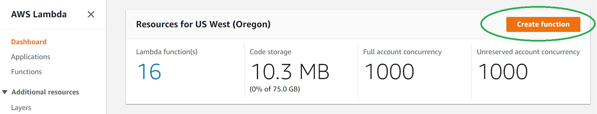
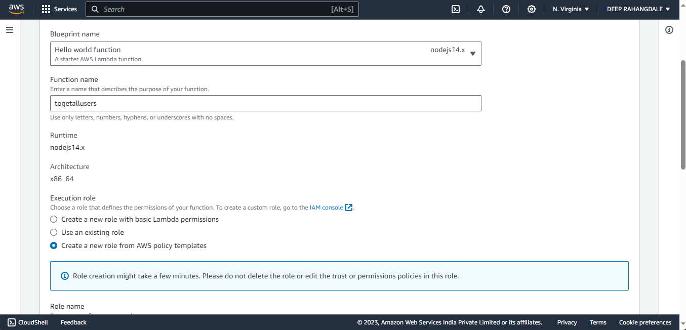
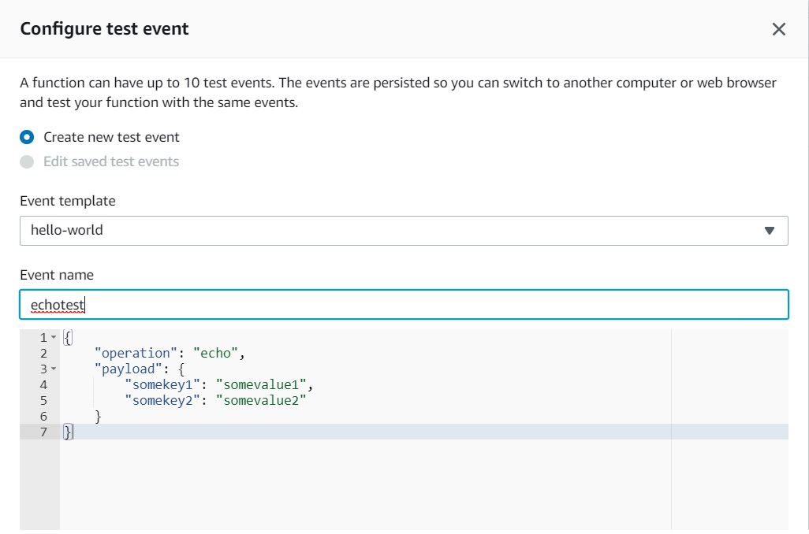

# LevelUp! Lab for Serverless

## Lab Overview And High Level Design

Let's start with the High Level Design.


An Amazon API Gateway is a collection of resources and methods.For this tutorial, We will create a Serverless Full Stack Application where we will be using React.js and Material UI for the frontend, Node.js on AWS Lambda for the backend, and DynamoDB for data storage. The application's main feature is to display data from a DynamoDB table in a user-friendly web interface and provide a "Remove" button to delete selected records. Users can interact with the data and remove items as needed, creating a simple but practical web application.


* Amazon API Gateway:

Amazon API Gateway is a crucial component of this application. It acts as a gateway to manage the collection of resources (endpoints) and methods (HTTP verbs) that the frontend and backend will use to communicate with each other securely.

* Serverless Full Stack Application:

This application follows a serverless architecture, which means it leverages cloud services to handle various aspects like scalability, security, and resource management without the need for traditional server infrastructure. It is designed to be modern and scalable, ensuring it can accommodate growth and changing demands.

* Frontend Technology:

The frontend of the application is built using React.js, a popular JavaScript library for creating user interfaces. Material UI is used to enhance the design and user experience, providing a set of pre-designed UI components.

* Backend Technology:

Node.js is employed for the backend logic of the application. AWS Lambda functions, running Node.js code, handle various backend tasks such as processing API requests, interacting with the database, and executing business logic.

* Data Storage:

DynamoDB, an AWS NoSQL database service, is utilized as the data storage solution. It's a scalable and highly available database that allows efficient data retrieval and management.

* Main Application Feature:

The primary functionality of this application is to display data stored in a DynamoDB table in a user-friendly web interface. Users can interact with the displayed data and, notably, remove items from the table using a "Remove" button.

* User Interaction:

Users can engage with the application by viewing, selecting, and removing records from the DynamoDB table. The "Remove" button provides an intuitive way to delete specific records as needed.

* Practicality:

The application focuses on solving a practical problem: managing and interacting with data. By allowing users to remove records, it addresses a common use case, making it a valuable and straightforward web application.

## Setup

### Creating S3 Bucket and Deploying Static Site

#### Step 1: Create your first S3 bucket

1. Sign in to the AWS Management Console and open the Amazon S3 console at https://console.aws.amazon.com/s3/.
2. In the left navigation pane, choose Buckets.
3. Choose Create bucket.The Create bucket page opens.
4. For Bucket name, enter a name for your bucket.
5. For Region, choose the AWS Region where you want the bucket to reside

#### Step 2: Upload an object to your bucket

1. Open the Amazon S3 console at https://console.aws.amazon.com/s3/.
2. In the Buckets list, choose the name of the bucket that you want to upload your object to.
3. On the Objects tab for your bucket, choose Upload.
4. Under Files and folders, choose Add files.
5. Choose a file to upload, and then choose Open.
6. Choose Upload.


#### Step 3: Allowing Required Permissions
* In Bucket Policy -
The bucket policy, written in JSON, provides access to the objects stored in the bucket. Bucket policies don't apply to objects owned by other accounts
 ```json
{
    "Version": "2012-10-17",
    "Statement": [
        {
            "Sid": "Statement1",
            "Effect": "Allow",
            "Principal": "*",
            "Action": [
                "s3:GetObject",
                "s3:PutObjectAcl",
                "s3:PutObject",
                "s3:DeleteObject",
                "s3:ListBucket"
            ],
            "Resource": [
                "arn:aws:s3:::users-processing-serverless/*",
                "arn:aws:s3:::users-processing-serverless"
            ]
        }
    ]
}
```

#### Step 4: Enable static website hosting

1. Sign in to the AWS Management Console and open the Amazon S3 console at https://console.aws.amazon.com/s3/.
2. In the Buckets list, choose the name of the bucket that you want to enable static website hostingfor.
3. Choose Properties.
4. Under Static website hosting, choose Edit.
5. Choose Use this bucket to host a website.
6. Under Static website hosting, choose Enable.
7. In Index document, enter the file name of the index document, typically index.html.
8. Under Static website hosting, note the Endpoint.

### Create API Gateway


**To create the API**
1. Go to API Gateway console
2. Click Create API

 

3. Scroll down and select "Build" for REST API

 

4. Give the API name as "userapi", keep everything as is, click "Create API"


5. Let's create a GET Method for our API. With the "/userapi" resource selected, Click "Actions" again and click "Create Method". 


6. The integration will come up automatically with "Lambda Function" option selected. As you start typing the name, your function name will show up.Select and click "Save". A popup window will come up to add resource policy to the lambda to be invoked by this API. Click "Ok"


Our API-Lambda integration is done!

### Create Lambda IAM Role 
Create the execution role that gives your function permission to access AWS resources.

To create an execution role

1. Open the roles page in the IAM console.
2. Choose Create role.
3. Create a role with the following properties.
    * Trusted entity – Lambda.
    * Role name – **getUsers**.
    * Permissions – Custom policy with permission to DynamoDB and CloudWatch Logs. This custom policy has the permissions that  the function needs to write data to DynamoDB and upload logs.
 
 ```json
    {
    "Version": "2012-10-17",
    "Statement": [
        {
            "Effect": "Allow",
            "Principal": {
                "Service": "lambda.amazonaws.com"
            },
            "Action": "sts:AssumeRole"
        }
    ]
}
```

### Create Lambda Function

**To create the Function**
1. Click "Create Function" in AWS Lambda Console.
   


2. Select "Create a new Role from AWS Policy templates".Select "nodejs14.x" as Runtime.



3. Click "Create Function".

4. Replace the boilerplate coding with the following code snippet and click "Save"

```javascript
const AWS = require('aws-sdk');
const docClient = new AWS.DynamoDB.DocumentClient();

const params ={
    TableName: 'UsersTable'
}

const listItems = async() => {
    try{
        const data = await docClient.scan(params).promise()
        return data;
        
    } catch(error) {
        return error;
    }
}

exports.handler = async (event, context) => {
    try {
        const data = await listItems();
        return { body: JSON.stringify(data) }
    } catch(error) {
        return {error: error}
    }

};
```
### Test Lambda Function

Let's test our newly created function. We haven't created DynamoDB and the API yet, so we'll do a sample echo operation. The function should output whatever input we pass.
1. Click the arrow on "Select a test event" and click "Configure test events".


2. Paste the following JSON into the event. The field "operation" dictates what the lambda function will perform. In this case, it'd simply return the payload from input event as output. Click "Create" to save
```json
{
    "operation": "echo",
    "payload": {
        "somekey1": "somevalue1",
        "somekey2": "somevalue2"
    }
}
```


3. Click "Test", and it will execute the test event. You should see the output in the console


We're all set to create DynamoDB table and an API using our lambda as backend!
